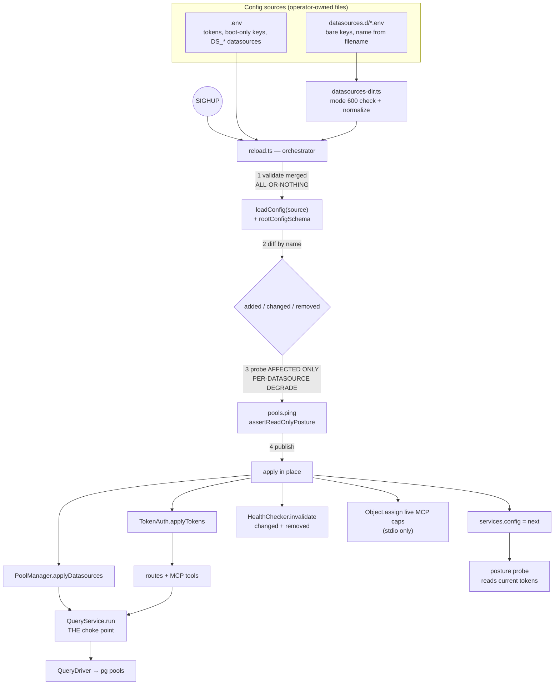

# System Design & Architecture

Feature: `multi-datasource-runtime`. Requirements:
[`docs/ai/requirements/2026-08-13-feature-multi-datasource-runtime.md`](../requirements/2026-08-13-feature-multi-datasource-runtime.md).

## Architecture Overview
**What is the high-level system structure?**

Config stops being a boot-time snapshot. A reload orchestrator swaps it atomically by **mutating the
state-owning objects in place** — `PoolManager`, `TokenAuth`, and the `Services.config` field. Nothing
above them learns about reload: routes and MCP tools keep the `Services` reference they captured at
registration, and the objects behind it change.

No `ConfigStore` class is introduced (see Design Decision 9). `Services.config` has exactly **one**
reader — `assert-readonly-posture.ts:210` (`services.config.tokens`) — so reassigning the field is
sufficient, and `QueryService`'s constructor is left untouched.



**Key components and responsibilities**

| Component | Responsibility |
|---|---|
| `config/datasources-dir.ts` *(new)* | Read `datasources.d/*.env`, enforce mode `600`, map filename → name, normalize bare keys to `DS_<NAME>_*` |
| `config/reload.ts` *(new)* | Orchestrate validate → diff → probe → publish; warn on changed boot-only keys |
| `config/load-config.ts` | Accept an injected source map instead of reading `process.env` directly |
| `pool/pool-manager.ts` | Gain `applyDatasources(next)` — create/drain/swap pools in place |
| `pool/health-checker.ts` | Gain `invalidate(name)` — drop cached verdicts for changed/removed datasources |
| `auth/token-auth.ts` | Gain `applyTokens(next)` and `capsById(id)` |
| `boot/assert-readonly-posture.ts` | Accept an optional datasource subset; skip the WASM warm-up when already warm |
| `query/query-service.ts` | Enforce the new datasource-level write gate at the existing choke point |
| `mcp/tools.ts` | New `list_datasources` tool |

**Technology choices**

- **SIGHUP, not `fs.watch`.** `fs.watch` is inconsistent across platforms and fires mid-write on partial
  files. A signal is explicit, atomic, scriptable, and trivially testable. A watcher stays cheap to add
  later precisely because reload is already atomic-or-nothing.
- **No new dependencies.** Env-file parsing is a few lines over `node:fs`; `node:fs.statSync().mode`
  gives the permission check.

## Data Models
**What data do we need to manage?**

### `datasources.d/<name>.env` — bare keys, filename is identity

```
# datasources.d/warehouse.env   (mode 600)   → datasource "warehouse"
HOST=warehouse.internal
PORT=5432
USER=agent_ro_pg
PASSWORD=<secret>
DATABASE=analytics
DEFAULT_SCHEMA=public
STATEMENT_TIMEOUT_MS=10000
DENIED_TABLES=billing_accounts
# WRITABLE=true          # omitted ⇒ read-only
```

Normalization: `HOST` → `DS_WAREHOUSE_HOST`, then handed to the **existing** `buildDatasource()` and
`datasourceSchema`. This is a key-rewrite step, not a second config model — the zod defaults,
`bool()` / `boolSecureDefault()` asymmetry, and every guard default are reused unchanged.

Name derivation: filename stem, lowercased, must match `/^[a-z0-9_-]+$/`. Only `*.env` is read, so
`example.env.disabled` serves as an in-directory template without being loaded.

Directory resolution: CWD-relative `./datasources.d`, mirroring how `--env-file-if-exists=.env` already
resolves `.env`; overridable with `DATASOURCES_DIR`. A missing directory is **not** an error — the
feature is opt-in and every pre-existing config must keep booting untouched.

### `DatasourceConfig` — one new field

```ts
// config.schema.ts — REQUIRED, no default, so neither loader path can forget it.
writable: z.boolean(),
```

Deliberately has **no zod default**. Each loader path must state it, which is what keeps the two
sources' semantics explicit and prevents a silent fail-open:

| Source | `writable` |
|---|---|
| `.env` `DS_<NAME>_WRITABLE` | `bool(...) ?? true` — backward compatible, today's behaviour preserved |
| `datasources.d/<name>.env` `WRITABLE` | `bool(...) ?? false` — fail-closed for newly added datasources |
| `DATABASE_*` fallback datasource | `bool(...) ?? true` — backward compatible |

### Merged config assembly

```
source map = { ...process.env, ...parsed(.env), ...normalized(datasources.d/*) }
           → loadConfig(source) → rootConfigSchema.safeParse → RootConfig
```

`.env` remains the only home for `TOKENS`, `MAX_ROWS_CEILING`, `PORT`, `HOST`. `datasources.d/`
contributes datasources only; a key there that is not a known datasource field is rejected, so a
stray `TOKENS=` in a datasource file cannot widen anyone's grants.

## API Design
**How do components communicate?**

### New MCP tool — `list_datasources`

```jsonc
// input:  {}
// output: { "datasources": [ { "name": "main", "defaultSchema": "public", "writable": false } ] }
```

Caps-filtered exactly as HTTP `/datasources` is, so a token cannot enumerate datasources outside its
allow-list. `writable` is included so a caller knows whether a write is even possible before attempting
one.

**`/datasources` gains `writable` too.** `datasources.route.ts:16` currently returns
`{name, defaultSchema}`. Leaving it would give the same concept two shapes across transports — exactly
the drift this codebase avoids elsewhere (`capabilityAllows`, `isSystemSchema`, `banned-functions`). One
line keeps them mirrored, and the two shapes should be asserted equal in a test.

`buildInstructions()` stops enumerating datasource names inline — they go stale the moment a reload
happens, and MCP clients cache instructions from initialization. It instead directs the agent to call
`list_datasources`, which is always current.

**Instruction staleness is transport-specific.** `mcp-http.ts:119` constructs a **new `McpServer` per
session**, so any streamable-HTTP session opened after a reload already gets freshly-built instructions.
Only the stdio transport holds one long-lived server whose instructions were built at boot. So this
mitigation matters for stdio specifically — worth stating, because it looks like a general problem and
is not.

**MCP identity refresh (stdio).** `registerTools(server, s, caps)` closes over the `caps` **object**, and
every handler reads `caps.id` / `caps.datasources` / `caps.canWrite` / `caps.schemas` off it. So the
refresh is an in-place field update, not a re-registration:

```ts
const fresh = services.auth.capsById(liveCaps.id)   // after applyTokens
if (fresh) Object.assign(liveCaps, fresh)           // every closed-over handler sees it
```

`Object.assign` replaces the array references wholesale, so no handler observes a half-updated
capability set. Note this leaves the live object distinct from the one held inside the new `TokenAuth`
entry — harmless, because the HTTP path re-authenticates per request and gets the entry's own object,
while the stdio path only ever consults the live one. Stage 1 already guarantees `capsById` resolves,
since a reload that invalidates the MCP identity is refused outright.

### Internal interfaces

```ts
// pool-manager.ts
applyDatasources(next: DatasourceConfig[]): Promise<ApplyReport>
// ApplyReport: { added: string[]; changed: string[]; removed: string[]; withheld: {name, reason}[] }

// health-checker.ts
invalidate(name: string): void          // drop cached verdict; called for changed + removed

// token-auth.ts
applyTokens(next: TokenConfig[]): void
capsById(id: string): Capabilities | null

// assert-readonly-posture.ts — subset + warm-up control
assertReadOnlyPosture(
  services: Services,
  identity?: string,
  opts?: { only?: string[]; warmParser?: boolean },
): Promise<void>

// reload.ts
reloadConfig(services: Services, opts: { envPath, datasourcesDir, liveCaps?: Capabilities }): Promise<ReloadReport>
```

**Why `assertReadOnlyPosture` needs a subset parameter.** It currently loops **every**
`pools.names()` and opens with a WASM parser warm-up. Reused verbatim on reload, adding one datasource
would re-probe all of them — up to `PROBE_TIMEOUT_MS` (5000ms) each — and re-emit the full posture log
every time. Reload passes `{ only: [...added, ...changed], warmParser: false }`; boot keeps today's
behaviour by passing nothing.

**Why `HealthChecker` needs invalidation.** It caches an `ok`/`fail` verdict per datasource for `ttlMs`
(default 5000). It holds only the driver, so it follows a pool swap automatically — but a **changed**
datasource would keep serving the pre-swap verdict from cache for up to a full TTL window, so
`/health` could report a stale answer about a pool that no longer exists. Reload invalidates the
changed and removed names.

### Authorization — the third write gate

Writes already require a write-mode token **and** explicit `readOnly:false`. This adds a datasource-level
gate, enforced at `QueryService.run()` — the same choke point as every other guard, so HTTP, MCP, and
introspection are covered by one check:

```
if (input.write && !dsCfg.writable) → ForbiddenError (403), audited
```

Placed after the single-statement scan and before DB contact, consistent with the existing guard order.

## Component Breakdown
**What are the major building blocks?**

**New files**

- `src/config/datasources-dir.ts` — directory read, `600` enforcement, filename→name, bare-key
  normalization, unknown-key rejection.
- `src/config/reload.ts` — the orchestrator (below).

**Modified files**

- `src/config/load-config.ts` — `loadConfig(source: Record<string, string|undefined> = process.env)`.
  Every `env()` call reads `source`. Makes config loading testable without mutating `process.env`.
- `src/config/config.schema.ts` — add required `writable`.
- `src/pool/pool-manager.ts` — `applyDatasources()`; the two Maps it already owns become mutable.
- `src/auth/token-auth.ts` — `applyTokens()`, `capsById()`; rebuilds the digest array in place.
- `src/pool/health-checker.ts` — `invalidate(name)`.
- `src/boot/assert-readonly-posture.ts` — optional `{ only, warmParser }`; `Services.config` read stays
  correct once the field is reassigned.
- `src/query/query-service.ts` — add the write gate. **Constructor unchanged** (see Design Decision 9),
  so none of its 7 construction sites are touched.
- `src/server.ts`, `src/mcp/mcp-server.ts` — `process.on('SIGHUP', …)`.
- `src/mcp/create-mcp-server.ts` — instructions no longer enumerate datasources.
- `src/mcp/tools.ts` — register `list_datasources`.
- `src/routes/datasources.route.ts` — add `writable` so the HTTP and MCP shapes stay mirrored.
- `.gitignore` — add `datasources.d/` (see Security below; verified not currently ignored).
- `.env.example`, `README.md` — document the directory, the bare-key shape, `WRITABLE`, and SIGHUP.
- `CLAUDE.md` — reconcile the two doc conventions (`plans/` vs `docs/ai/`) now that both exist.

**Known blast radius**: making `writable` a required field means every literal `DatasourceConfig`
construction site must supply it. Known sites: `test/helpers.ts` `makeConfig()` and
`test/integration/pg.integration.test.ts` `dsConfig()` — the latter already omits `deniedTables` and
`sensitiveRelationDenylist`, so it is typed loosely and will need attention. Planning should sweep for
others rather than assume these two are exhaustive.

**Reload orchestration — the two-stage failure model**

*Stage 1 — validation, all-or-nothing.* Any failure logs and returns; the running config is untouched.
- every `datasources.d/*.env` is mode `600` (else: refuse, naming the file and the `chmod` fix)
- filenames are valid datasource names; no duplicates
- no name defined in **both** `.env` and `datasources.d/` (refuse; never silently override a credential)
- merged map parses under `rootConfigSchema`, including the existing token→datasource cross-reference
- the reload does not invalidate the identity the MCP process runs as — checked by re-authenticating
  `MCP_TOKEN` against the *candidate* token set, not by id alone, so a **rotated secret** is caught as
  well as a removed token. Either would leave a live process unable to authorize its own tool calls.

*Stage 2 — probes, per-datasource degrade.* The server never dies here. **How each path routes its probe
to the candidate rather than the live pool is Design Decision 11** — that mechanism is what makes the
"probe before publish" sequences below actually expressible.
- **added**: build pool → `ping()` → `assertReadOnlyPosture()` → publish. `ping` failure ⇒ withheld
  (logged, not fatal — boot exits 1 here, reload must not).
- **changed**: build the new pool alongside, `ping()` → `assertReadOnlyPosture()`, swap, then
  `pool.end()` the old one so in-flight queries finish on their existing connections. The posture probe
  is **not** optional on this path: changed credentials can mean a different role with different write
  grants, so skipping it would let a swap move a datasource from `OK` to `WEAK` with nothing in the log.
- **removed**: drop from routing (`names()`) immediately so new requests get a clean 400 from
  `datasourceReady()`, but **keep the entry resolvable in a draining map** until `pool.end()` resolves,
  then delete. This closes a real race: `PoolManager.getPool()`/`getConfig()` throw a plain `Error`, which
  `statusOf()` maps to **500**, and a request that already passed `datasourceReady()` (which reads
  `names()`) can reach `getConfig()` at `query.route.ts:23` / `query-service.ts:103` after the entry is
  gone. Retaining the entry through the drain window means such a request completes normally instead of
  surfacing a spurious 500.
- posture `WEAK` ⇒ publish + `log.warn`, identical to boot.
- **pool construction itself throws** (a config `pg` rejects outright) ⇒ caught per datasource and
  reported as withheld, never propagated out of the reload.
- probes run for **added + changed only**, via `assertReadOnlyPosture(services, id, { only, warmParser: false })`.

Token state, `services.config`, `HealthChecker` invalidation, and the live MCP caps update are all
applied inside stage 2's publish step, so grants and datasources become visible together.

**Boot-only keys.** These are read once at startup and cannot be applied to a running process (bound
sockets, or constructor-injected values). Reload **compares** them and warns per changed key that a
restart is required — never applied silently, never ignored silently. They fall into two groups that
need *different* comparison baselines, because only some of them reach `RootConfig`:

| Key | Baseline for comparison |
|---|---|
| `PORT`, `HOST`, `LOG_LEVEL`, `MAX_ROWS_CEILING` | `services.config` vs the candidate `RootConfig` — these parse through zod |
| `HEALTH_CACHE_TTL_MS`, `ALLOW_PUBLIC_BIND`, `MCP_TRANSPORT`, `MCP_HTTP_HOST`, `MCP_HTTP_PORT`, `DATASOURCES_DIR` | merged source map vs `process.env` — these **never enter `RootConfig`** (read directly at `services.ts:43`, `bind-guard.ts:49`, `mcp-server.ts:62`, `mcp-http.ts:65`) |

The second baseline is sound because **production code never writes `process.env`** — verified by grep;
only tests do, which is precisely why `loadConfig(source)` injection is worth having. So `process.env`
still holds each key's boot value and is a valid point of comparison for keys that zod never sees.

`MCP_TOKEN` is deliberately absent from both groups: it is the process identity, and a change to it is
handled by the stage-1 identity check rather than a warn.

## Design Decisions
**Why did we choose this approach?**

1. **Merged reload of `.env` + `datasources.d/`** over datasources-only. Datasources-only would force
   `TOKEN_*_DATASOURCES=*` on the agent token, coarsening a capability model the rest of this codebase
   treats as load-bearing. Merged reload subsumes the wildcard approach — you may still use `*` for a
   one-file add — without giving up per-datasource scoping.

2. **Bare keys with filename identity** over repeating `DS_<NAME>_` per line. Files are hand-authored
   (no CLI), so authoring cost is real. Normalizing to the existing prefix keeps a *single* config
   model behind the loader, and removes the filename/prefix mismatch trap.

3. **`writable` is required in the schema, with per-source defaults in the loaders** rather than a zod
   default. A default would have to be either `true` (fail-open for new datasources — the thing we're
   guarding) or `false` (silently breaks existing `.env` write datasources). Requiring it forces both
   paths to state their intent, and the asymmetry is then visible in one table rather than implied.

4. **The write gate is explicit opt-in, not the posture verdict.** Considered and rejected: keying
   forced-read-only on posture `WEAK`. `assert-readonly-posture.ts:225` computes
   `backstop = writableRelations === 0 && !isSuperuser && !writeAllData`, so *any* datasource whose role
   can write — i.e. every working write datasource — reports `WEAK`. Gating on it would make writes
   impossible everywhere. Posture stays observability; `WRITABLE` carries the intent.

5. **Mutate `PoolManager` / `TokenAuth` in place** over rebuilding `Services`. Routes and MCP tools
   capture `Services` at registration; rebuilding would require a holder indirection at every consumer.
   Both classes are already the sole owners of the state in question, and `QueryService` calls
   `pools.getConfig()` per run, so it follows a swap for free.

6. **Boot and reload share one rule set.** Every difference between them is a trap: the same files would
   yield different realities depending on how the process started. The only sanctioned divergence is
   `ping` failure — fatal at boot (nothing is serving yet), withheld on reload (something is).

7. **SIGHUP over a file watcher** — see Architecture Overview.

8. **Alternatives rejected earlier** (full rationale in the brainstorm): agent-supplied credentials via
   an `add_datasource` tool (places a secret in model context); grants declared inside the datasource
   file (second source of truth for the token↔datasource relation); same-cluster multi-database reuse
   (doesn't cover different clusters); `.pgpass` / `PGSERVICE` delegation (`pg` is not libpq — its
   `.pgpass` support is deprecated and removed in `pg@9.0`, and `pg_service.conf` is unsupported).

9. **No `ConfigStore`; `MAX_ROWS_CEILING` stays boot-only with a warn.** *(Phase 3 revision — the
   original design introduced a `ConfigStore` class.)* Feasibility review found `Services.config` has
   exactly one reader (`assert-readonly-posture.ts:210`), so a live config needs only a field
   reassignment. The store's remaining purpose was letting `QueryService` follow a changed
   `maxRowsCeiling`, which would convert its third constructor parameter from `number` to a getter and
   touch **7 call sites** (1 src, 6 test) for a setting no acceptance criterion requires to be live. The
   silent-no-op risk that made boot-only unattractive is removed by comparing boot-only keys and warning
   when one changes. Net: less code, no test churn, no silent surprise. Revisit only if a second reader
   of live root config appears.

10. **Probe the affected subset, not everything.** Reusing `assertReadOnlyPosture` verbatim would re-probe
    every datasource on every reload (up to 5s each) and re-emit the whole posture log, making a
    one-datasource add scale with total datasource count. The subset parameter keeps reload cost
    proportional to what actually changed.

11. **`names()` becomes the *routable* set; `getPool`/`getConfig` resolve routable ∪ staged ∪ draining.**
    *(Phase 5 amendment — the stage-2 sequence above was not expressible as written.)*

    `assertReadOnlyPosture` probes **through** `services.queryService` → `driver.connect(name)` →
    `pools.getPool(name)` (`postgres-driver.ts:61`). So "probe the candidate *before* publishing it" cannot
    be expressed while one name maps to one pool: the probe reaches whatever `getPool` already returns.
    `PoolManager` therefore separates *resolvability* from *routability*:

    | Set | Meaning | Read by |
    |---|---|---|
    | routable | serving callers | `names()` |
    | staged | built + resolvable, not yet serving | `getPool` / `getConfig` only |
    | draining | removed, `pool.end()` in flight | `getPool` / `getConfig` only |

    **This is safe only because every request path gates on `names()` before it resolves a pool** — verified
    by grep, and the invariant to re-check before touching any of it: `route-helpers.ts:36` (`datasourceReady`,
    covering `/query` and all three `/introspect/*` routes), `mcp/tools.ts` (every MCP tool — the `authorize`
    helper, the `list_schemas` inline check, and `list_datasources`, which *derives* its whole list from
    `names()` and only ever calls `getConfig()` on a name that came from it), `health.route.ts:12`,
    `datasources.route.ts:14`. No caller reaches `getPool`/`getConfig` without having passed one of those.
    A staged datasource is consequently unreachable by any caller while it is probed. **Any new caller of
    `getPool`/`getConfig` must gate on `names()` first, or it will be able to reach a staged datasource.**

    The three diff paths then differ, and the asymmetry is the point:

    - **added** — stage → `ping` → posture → publish (move to routable). Both probes precede visibility,
      which is what the acceptance criterion asks for.
    - **changed** — the name collides with the live entry, so staging cannot apply. Build the candidate
      pool, `SELECT 1` **directly on the candidate pool object** (not through routing), and only then swap
      it into the routable slot, posture-probe, and `pool.end()` the old pool.
    - **removed** — routable → draining, per the race described in stage 2 above.

    **`ApplyReport` therefore carries TWO failure fields, not one** *(Phase 5 addition)*. `withheld` means
    **not serving** — construction, ping, or the pre-publish probe failed. A post-swap posture failure on
    the `changed` path is not that: `ping` already passed and the new pool is live, so it is reported as
    `postureUnverified` — **serving, posture unestablished**. Collapsing them would make the reload
    security log say a live datasource is unavailable, which is the opposite of the truth. The two are
    logged as separate fields for the same reason.

    Change detection is a **full deep-compare**, so a datasource whose config round-trips identically is
    left completely untouched — same pool object, no ping, no posture probe. This is what keeps a SIGHUP
    issued for one datasource from churning every other datasource's warm pool.

    **Consequence, stated deliberately:** on the `changed` path a request arriving between the swap and the
    posture probe uses a pool that has been *pinged* but not yet *posture-probed*. That is sound because
    **posture never gates, it only observes** — per Design Decision 4, every working write datasource
    reports `WEAK`, so no publish decision has ever keyed on it, at boot or on reload. `ping` is the gate,
    and `ping` precedes the swap. The alternative — holding the swap until posture returns — would stall
    the datasource for up to `PROBE_TIMEOUT_MS` (5000ms) behind a check whose result cannot change the
    outcome. This note exists so the window reads as a decision rather than an oversight.

## Non-Functional Requirements
**How should the system perform?**

**Security** — the dominant requirement.

- Credentials enter through operator-controlled files only. No tool schema, endpoint, or agent-reachable
  surface accepts one. The `add_datasource`-style tool is a non-goal on principle.
- **`.gitignore` must gain `datasources.d/` — this is a shipping deliverable, not cleanup.** Verified:
  `git check-ignore -v datasources.d/warehouse.env` exits **1** (not ignored) on the current
  `.gitignore`. Its `.env` and `.env.*` patterns match on *basename*, and `warehouse.env` starts with
  neither — so without this change the feature's own credential files are committable by default. Add
  `datasources.d/*` plus a `!datasources.d/example.env.disabled` negation so the template stays tracked.
  **The pattern must be `datasources.d/*`, not `datasources.d/`** *(Phase 5 correction — the directory
  form was specified here originally and does not work)*: git cannot re-include a file whose parent
  directory is excluded, so the directory form silently swallows the negation and the template with it.
  Verified both ways with `git check-ignore`; regression-tested in `test/gitignore.test.ts`.
- Files must be mode `600`; the loader refuses otherwise and names the `chmod` command. With no CLI to
  set the mode, this check is the only thing between a default-umask file and a world-readable password.
- Reload is logged as a security event: names added/removed/changed/withheld, **never values**. Reuses
  the existing `redact-error.ts` boundary for any error text that escapes to a caller.
- Fail-closed everywhere: unknown keys rejected, `writable` defaults false for new datasources, a
  collision refuses the whole reload, an unparseable file changes nothing.
- No datasource is ever published unprobed — closing the gap where `read-only posture` would silently
  report on a subset.

**Reliability**

- A reload must never terminate the process or fail an in-flight query. Old pools are drained via
  `pool.end()`, which waits for checked-out clients.
- Invalid input at stage 1 leaves the previous config bit-for-bit unchanged.
- The existing mandatory `pool.on('error')` handler is attached to every newly created pool.

**Performance**

- Reload cost ≈ one `ping` + one posture probe per added/changed datasource (`PROBE_TIMEOUT_MS` 5000 each).
- Steady-state query path is unchanged: one extra `dsCfg.writable` boolean check inside an existing
  config lookup. No added allocation or I/O.

**Scalability / availability**

- Pool-per-datasource topology is unchanged; adding datasources adds pools, bounded by operator intent
  and each datasource's `POOL_MAX`.
- Zero-downtime for the long-running HTTP gateway, which is the deployment where this matters.
